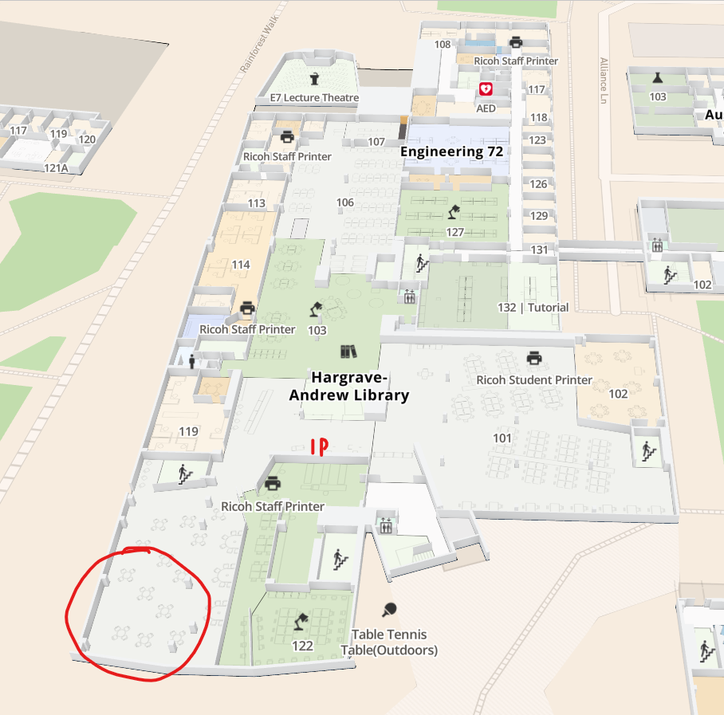

# ECE4078_Lab_2025
This repo is for ECE4078 (Intelligent Robotics) labs for 2025. There is a quick lab overview video available [here](https://drive.google.com/file/d/1PT0DUQz8tL-ve9bB-mJOfK4l_KZ_MImg/view?usp=sharing). 

## Labs

For each milestone, you and your group will have to submit your implementation on Moodle before the marking lab session, and perform a live demonstration during the marking lab session. All lab sessions are located at 16 Alliance, room 224. Labs for ECE4078/5178 runs on:
- Tuesdays: 9am - 3pm
- Wednesdays: 9am - 6pm
- Thursdays: 9am - 6pm

## Lab locations for testing

### Lab room 224, 16 Alliance

You will not receive card access to room 224 outside of lab hours due to OH&S reasons. However, the teaching team might open up the labs during the busy weeks (ie. close to milestones/final demo) for you to use the space for testing your robots outside of classes during business hours. This will be communicated through the forums. We highly encourage you to get all the data you need during your allocated lab session, and to use the other existing arena spaces for testing. 

### Hargrave library

The Hargrave library team has kindly provided us with access to 4 arenas on level 1 of the library (see below). There will be no official booking system through the library (or through us), so please provide usage of the arenas fairly to each other while the library is open, and be respectful of the library staff (ie. pack up early if your team is working towards library's closing time). Please abide to the following rules specified by the library staff, otherwise access to these arenas will be revoked for the entire cohort:
-  You are more than welcome to use the docking stations and monitors where they are located in other parts of the Library (that is, not unplugging them and moving them to the arena). In the arena space, there are also three older ‘mediascape’ tables which they could use if they required a display.
-  If you require more space, you will need to speak to Library staff rather than setting up additional arenas in other parts of the Library. Depending on how busy the space around the arena is, it may be possible to extend the amount of space allocated to the project.
-  In line with our usual expectations about the use of Library space, the students should remain respectful of the needs of other Library users, especially as you will be working in groups. You are welcome to talk in the allocated space, but it will be important for them to be mindful of keeping noise to an appropriate level. For general expectations about conduct within the Library students may refer to our [Terms of Use](https://www.monash.edu/library/about/terms).
-  It is also important to flag that you should not leave your belongings or equipment unattended in the space and that you will need to pack up at the end of your session. This is both to ensure a fair use of the space, and to minimise the risk of items going missing. Although we endeavour to maintain safe spaces, Library staff are unable to take responsibility for items left unattended in the space.

### Woodside space

We are currently working with Woodside staff to organise arena space. This will be a work-in-progress throughout the semester and we will update the information here whenever we can. 

## Help desks

Help desks runs after the workshops on Mondays, 12pm-2pm, 16 Alliance, Room 224. 

