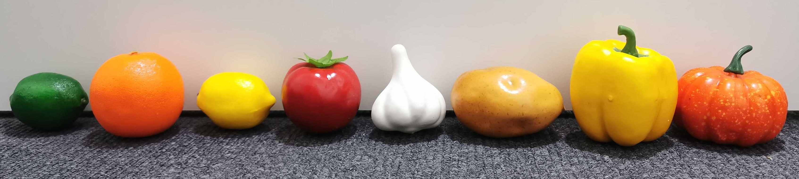
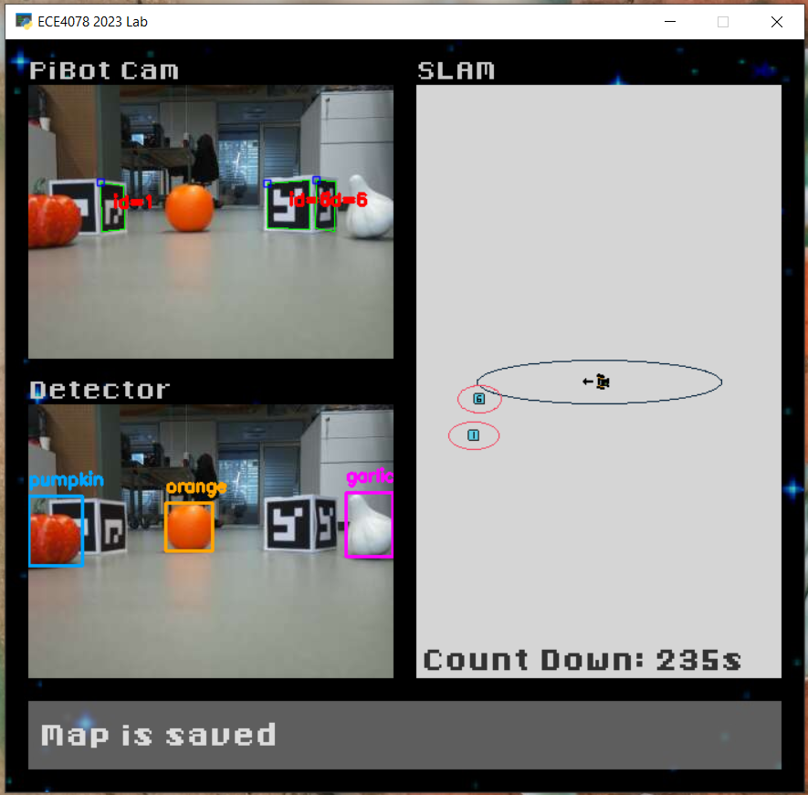

# Milestone 2: Object Recognition and Localisation
- [Introduction](#introduction)
- [Supporting scripts](#supporting-scripts)
- [Data collection (Week 5)](#step-1-data-collection-week-5)
- [Training the detector (Week 5)](#step-2-training-your-yolo-model-week-5)
- [Estimating the target poses (Week 6)](#step-3-estimating-target-poses-week-6)

---
## Preface
This is an incomplete README that may contain missing images and references. This is because all the reference images, as well as the code, notebooks, etc. will be provided closer towards the start of Milestone 2. Some links (such as marking) may be missing for the time being - these will be uploaded during the semester as we finalise details. 

## Introduction
In M2, your PenguinPi robot will learn to recognise different types of fruit and vegetables via its camera. It will also estimate where these objects are located in the supermarket (arena) based on the actual size of the object, the size of the bounding box of the observed object in its camera view, and its own location at the time of observation using SLAM (M1). 

There are a variety of possible types of fruits and vegs for the classification model to recognise from such as potato, lemon, lime, tomato, yellow capsicum, pear, pumpkin, and garlic (final list might change closer to week 5). There will be multiple objects in the arena in addition to the ArUco markers. There may be duplicate objects from the same type, or types of object not appearing in the arena, e.g., 2 pears, 2 lemon, 1 lime, 1 tomato, 2 capsicum, 1 pumpkin, 1 garlic (no potato).

[NOTE] The fruits and vegs will stand up reasonably straight, as shown in the photo when placed in the arena. For example, the garlic won't be lying on its side. However, you may not assume all fruits are positioned consistently and angled perfectly.

In Week 5, you will collect and annotate image data to train a fruit&veg classifier using [the YOLOV8 model](https://github.com/ultralytics/ultralytics). Make sure you take enough photos of the fruit and veg models during your lab session so that you can work on data annotation and model training outside of the lab. You will also measure the fruit and veg models to get their ground truth dimensions, which will be used for estimating their location in Week 6.

In Week 6, you will complete codes to estimate the location of detected objects and generate a map of the estimated locations of the fruits and vegs in the arena by driving your robot around the arena, making use of your trained fruit&veg classifier, as well as your M1 code. 

Your M2 will be marked based on the accuracy of your fruit&veg classifier on a set of testing photos, as well as the performance of the generated object location map during a live demo. Please see the [M2 marking instructions](M2_marking.md) for detailed info.

[NOTE] This is just an example and the fruits and vegetables used in the lab may be different from this example.

More details will be released closer to week 5.