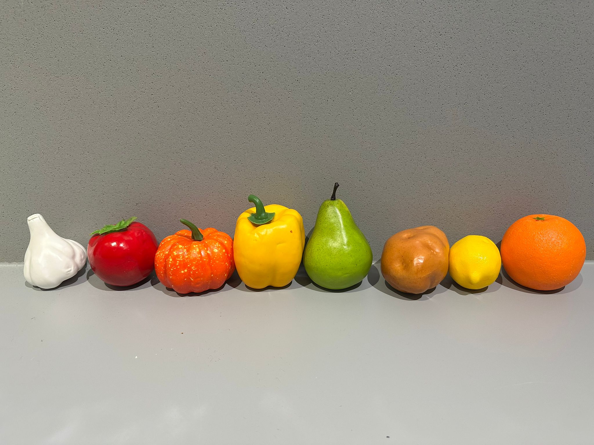
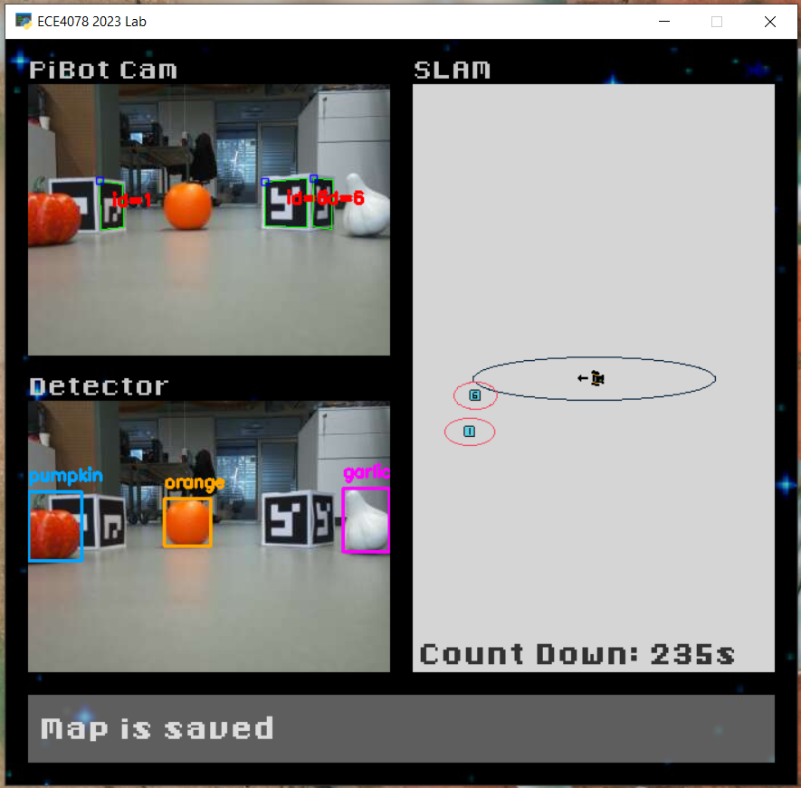
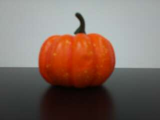
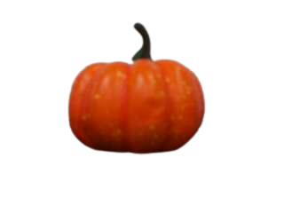
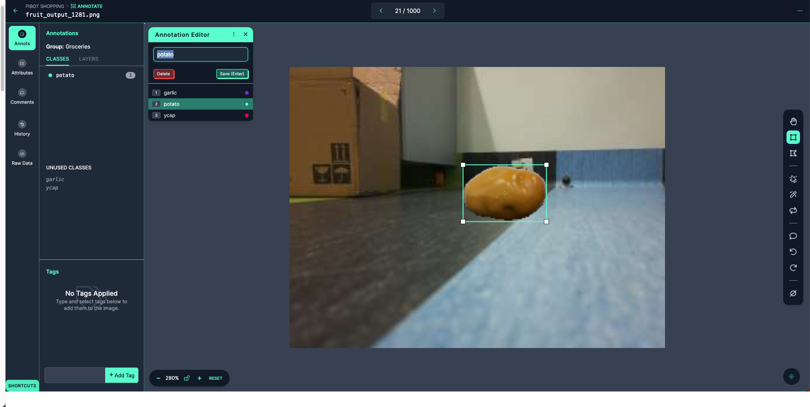
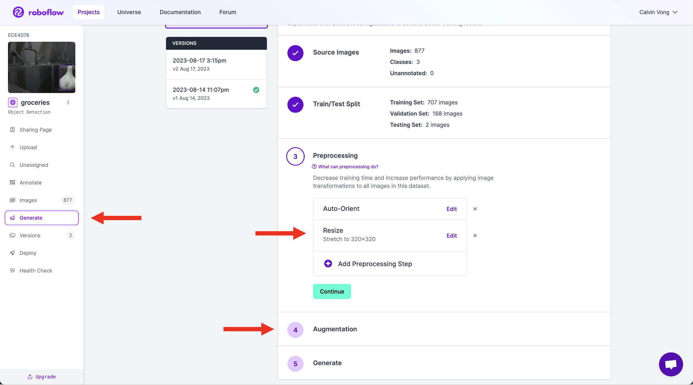
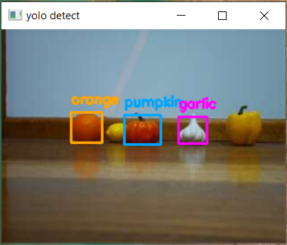

# Milestone 2: Object Recognition and Localisation
- [Introduction](#introduction)
- [Supporting scripts](#supporting-scripts)
- [Data collection (Week 5)](#step-1-data-collection-week-5)
- [Training the detector (Week 5)](#step-2-training-your-yolo-model-week-5)
- [Estimating the target poses (Week 6)](#step-3-estimating-target-poses-week-6)

---
## Introduction
In M2, your PenguinPi robot will learn to recognise different types of fruit and veg via its camera. It will also estimate where these objects are located in the supermarket (arena) based on the actual size of the object, the size of the bounding box of the observed object in its camera view, and its own location at the time of observation using SLAM (M1). 

There are 8 possible types of fruits and vegs for the classification model to recognise from, namely orange, lemon, pear, tomato, capsicum, potato, pumpkin, and garlic. These fruits and veg will be in the 2.4m x 2.4m arena in addition to the 10 ARUCO markers. There may be duplicate objects from the same type, or types of object not appearing in the arena, e.g., 2 oranges, 2 lemon, 1 pear, 1 tomato, 2 capsicum, 1 pumpkin, 1 garlic (no potato). The arena may have other coloured target fruits/veg (ie. different coloured capsicum), or items that are not part of the original package of fruits / vegs. 

The fruits and vegs will stand upstraight as shown in the photo when placed in the arena, e.g., the garlic won't be lying on its side.



In Week 5, you will collect and annotate image data to train a fruit&veg classifier using [the YOLOV8 model](https://github.com/ultralytics/ultralytics). Make sure you take enough photos of the fruit and veg models during your Week 5 lab session so that you can work on data annotation and model training outside of the lab. You will also measure the fruit and veg models to get their groundtruth dimensions, which will be used for estimating their location in Week 6.

In Week 6, you will complete codes to estimate the location of detected objects and generate a map of the estimated locations of the fruits and vegs in the arena by driving your robot around the arena, making use of your trained fruit&veg classifier, as well as your C1 and M1 codes. 

Your M2 will be marked based on the accuracy of your fruit&veg classifier on a set of testing photos, as well as the performance of the generated object location map during a live demo. Please see the [M2 marking instructions](M2_marking.md) for detailed info.




Keyboard commands related to running M2 (```python operate.py```). Inside the GUI:
- press arrow keys and space for driving the robot (C1)
- press ENTER to run SLAM, ```s``` to save the SLAM map at any time (M1)
- press ```i``` to take a picture (for collecting training data, saved under the ```pibot_dataset``` folder, doesn't require a trained YOLO model)
- press ```p``` to run the trained YOLO object detector (bounding box visualised in bottom left view)
- press ```n``` to save the robot's current pose estimated by SLAM (appending to "lab_output/image.txt") and the corresponding observation image (as "lab_output/pred_*.png")
- after running operate.py to gather the set of observations and their matching robot pose and the SLAM map, run TargetPoseEst.py in a new terminal to generate targets.txt (map of objects) from these observations.

---
## Supporting scripts
- [operate.py](operate.py) is the central control program that combines keyboard teleoperation (C1), SLAM (M1), and object recognitions (M2). **You need to copy over the [utility scripts](../Week00-01/util) and the [GUI pics](../Week00-01/pics) from C1, and the [calibration parameters](../Week02-04/calibration/param/) and [SLAM scripts](../Week02-04/slam/) from M1 to run it.** In addition, it calls for the object detector that you will develop in M2.
- [YOLO](YOLO/) is an example trained YOLO detector, which can sort of recognise garlic, pumpkin, and orange. You'll need to [train your own YOLO detector](#step-2-training-your-yolo-model-week-5) to recognises all target types with better accuracy.
- [lab_output](lab_output/) contains example outputs when running M2, including [images.txt](lab_output/images.txt) matching each image observation "pred_*.png" with the robot's pose estimated by SLAM when that image was taken, and [targets.txt](lab_output/targets.txt) which is the estimated map of the objects generated by [TargetPoseEst.py](TargetPoseEst.py)
- [image background randomiser](image_background_randomiser/) is an optional tool for you to create training images with randomised backgrounds
- [TargetPoseEst.py](TargetPoseEst.py) is the script that you'll need to modify to generate estimated target location map in [week 5](#step-3-estimating-target-poses-week-5)


---
## Step 1: Data collection (week 5)
In addition to collecting training images, remember to measure the dimensions of the fruit&veg models and update your [target_dimensions_dict](TargetPoseEst.py#L38), which you'll need for estimating the target map in week 6.

### 1.1 Collecting training images with your PenguinPi robot
To take images with the PenguinPi robot, first you need to run the [operate.py](operate.py) script. Then, press  ```i``` 
to take a picture with the PenguinPi robot and the image will be saved to the ```pibot_dataset``` folder. Our main goal 
is to collect images of the fruits and vegs in different orientations, light conditions and backgrounds. The more variety
you have in your dataset, the more robust your model will be.

To simplify the data collection process (instead of manually taking 1000+ images), one approach is to do the following steps:
1. Take a small collections of photos of each fruit and veggie at different orientations with simple backgrounds (e.g. a white sheet of paper)



2. Remove the photo background using [this tool](https://www.remove.bg/) or other software of your choice



3. Take a collections of background images of the lab with the robot, or download some random images online
4. Use the [image background randomiser](image_background_randomiser/image_generator.py) script provided to you to generate a large number of images with random backgrounds

### 1.2 Annotating your dataset
To annotate your dataset, we recommend using [Roboflow](https://roboflow.com/) as it is free to use. You can upload your 
images and annotate them using the web interface. You can then export the annotations in YOLO format. However, there are 
many other free annotation tools available online, feel free to use any tool you like.

#### Annotation tips:
- Make sure your bounding boxes are **tight** around the object, as shown in the example below

- Roboflow has the [assisted labelling](https://blog.roboflow.com/announcing-label-assist/) feature which can speed up the annotation process. You may start with labelling ~30 image per class manually, then train a model and use the assisted labelling feature to label the rest of the images.

### 1.3 Generating dataset on Roboflow
After you have annotated your dataset, you can use Roboflow to generate a dataset in YOLO format. 

Roboflow also provide option to augment your dataset, which can help improve the robustness of your model.
Have a think about what augmentations are meaningful for our use case, you may add as many augmentations as you like.



[NOTE] Please check the aspect ratio of your training images collected by your robot shown in [image properties](lab_output/pred_0.png) and update the image size from [TargetPoseEst.py](TargetPoseEst.py#L54) and [detector.py](YOLO/detector.py#L69) if needed.

[NOTE] Please remember to include some images for validation and test in your dataset split so the training notebook doesn't return an error.

---
## Step 2: Training your YOLO model (week 5)

See [YOLOv8_training_notebook.ipynb](YOLOv8_training_notebook.ipynb) for how to train your YOLO with the annotated dataset (you can run this notebook on Google Colab or in your local notebook env).

An [example trained YOLO detector](YOLO/) is provided, which can recognise three types of fruit&veg with room for performance improvements. Replace the [example detector model](YOLO/model/yolov8_model.pt) with your own trained model.

[NOTE] This example detector was trained using a total of 1000 images (around 100 manually annotated), with 4 photos taken by the robot on each of the three types of targets from different viewing angles and the rest of the image generated by randomising the background. The fruits and vegetables used in the lab may be different from this example.

You'll need to demonstrate your trained detector model with a set of given marking images as part of the M2 live demo marking.



---
## Step 3: Estimating target poses (week 6)

### 3.1 Detecting targets with corresponding robot poses
To estimate pose of targets, you will need to run the SLAM component (press ENTER to run) while running the target detector, so that the robot's pose is known. 

Every time you want to perform object detection, press ```p``` to run the detector, then press ```n``` to save the robot's current pose estimated by SLAM (as "lab_output/image.txt") and the corresponding observation image (as "lab_output/pred_*.png"). 

After you have collected the detector's outputs for all targets, you may press "s" to save SLAM map (performance of your SLAM will influence the target pose estimation). You can exit the GUI by pressing ESC.

### 3.2 Generating estimated target map from observations
Run ```python TargetPoseEst.py```, which will read in the observation saved inside lab_output and generate an estimated object map as "lab_output/targets.txt" during a run through the arena to generate an estimated map of all the observed targets.

**Modify [TargetPoseEst.py](TargetPoseEst.py)** to estimate the locations of the fruits and vegs based on the detector's outputs and the robot's poses. 
- You may improve the [estimate_pose function](TargetPoseEst.py#L15) for computing the target pose using the robot's pose, the detector's output, and the target's true dimensions in each image.
- If your training image is in a different size than the robot's camera size of 640x480 pixels, remember to change [how the x_shift is computed in the estimate_pose_function](TargetPoseEst.py#L54)
- Replace the [merge_estimation function](TargetPoseEst.py#L69) with your own codes to merge the estimations from multiple observations using filtering or clustering approaches instead of always taking the first estimation of a target type.
- In the testing arena, the fruits/vegs will be at least 15cm apart, but a fruit/veg may be within 15cm of a marker block.
- The [TargetPoseEst.py](TargetPoseEst.py) generates an estimation result file as "lab_output/targets.txt", which is then used to be compared against the groundtruth map for computing the target pose estimation errors.
- **Make sure your modified "TargetPoseEst.py" generates a "targets.txt" file that is in the same format as the [given example output](lab_output/targets.txt)**. Generating the estimation map in a wrong format may resulting in it not being compatible with the evaluation scripts and thus getting 0pt for the [M2 target_est_score](M2_marking.md#evaluation).
